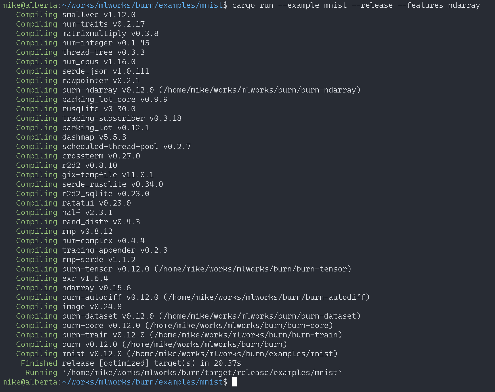
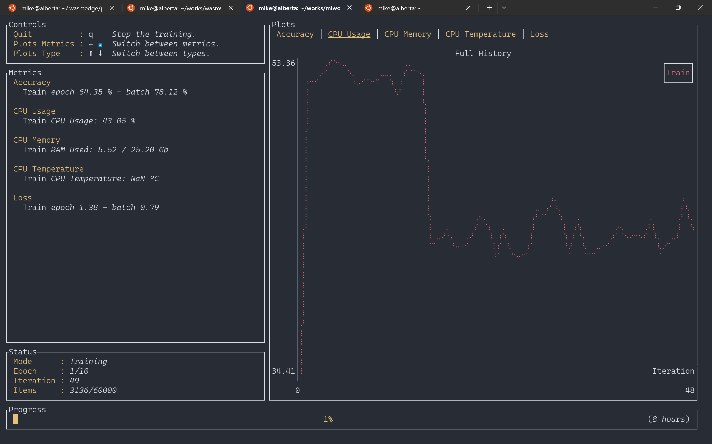
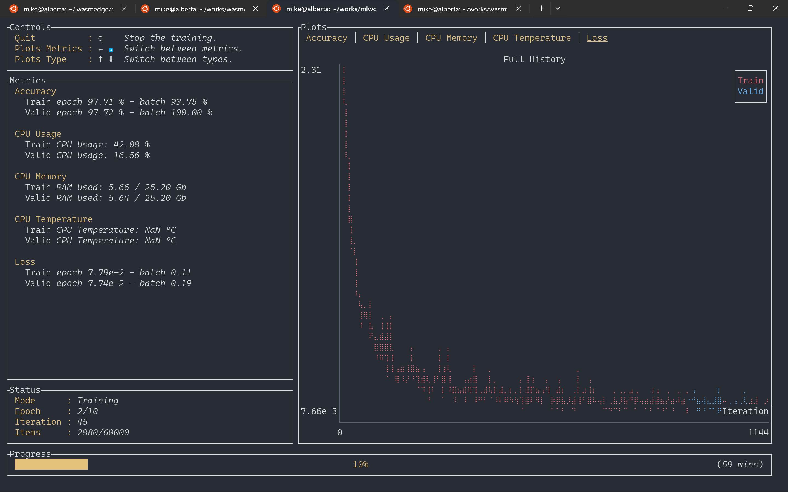
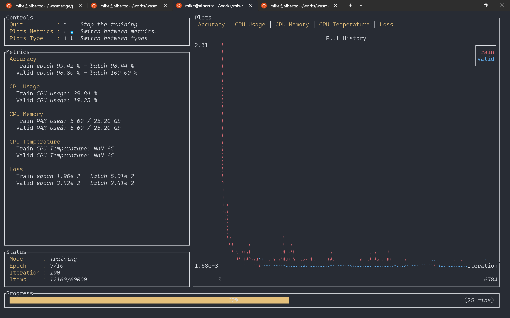
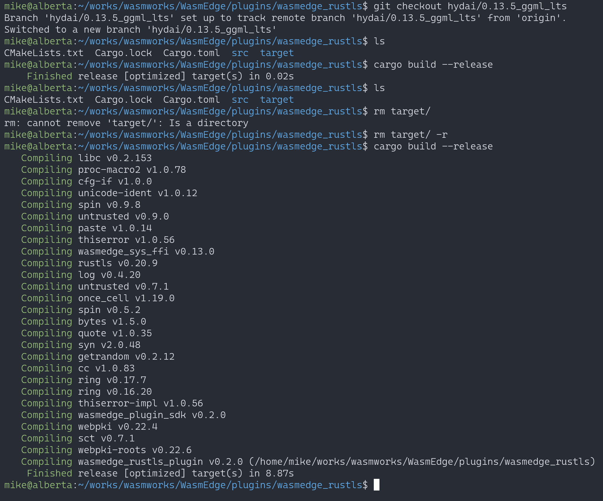
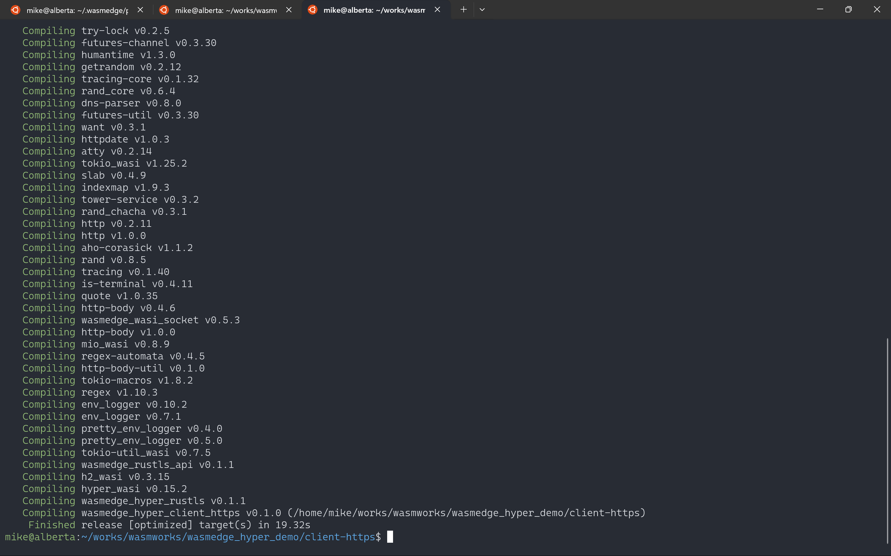
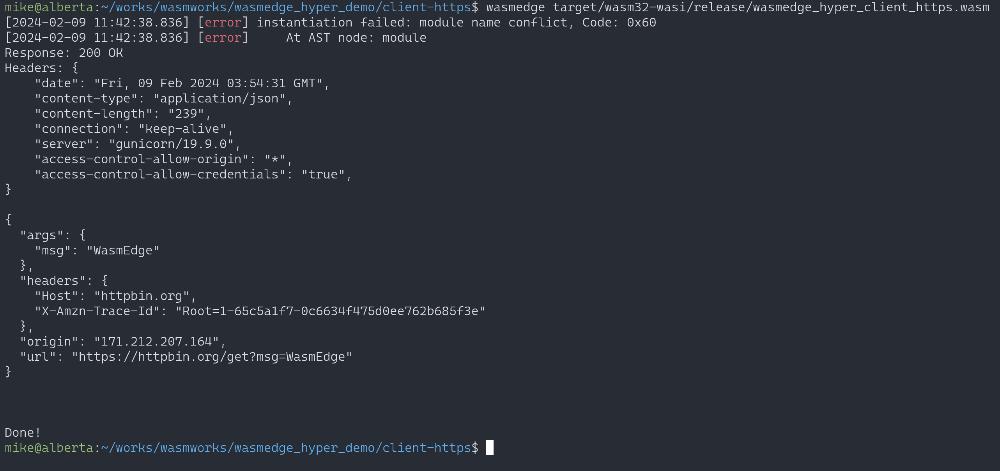

# Summary of the LFX WasmEdge 3172 Pretest

Contents:

- Compile burn
- Run MNIST example with wgpu backend
- Run MNIST example with ndarray backend
- Compile wasmedge_rustls plugin
- Use wasmedge_hyper_demo to test wasmedge_rustls plugin

### Compile burn



### Run MNIST example with wgpu backend

```
cd burn/examples/mnist
cargo run --example mnist --release --features wgpu
```



### Run MNIST example with wgpu ndarray

```
cd burn/examples/mnist
cargo run --example mnist --release --features ndarray
```





### Compile wasmedge_rustls plugin

```
git clone https://github.com/WasmEdge/WasmEdge
git checkout hydai/0.13.5_ggml_lts
cd WasmEdge/plugins/wasmedge_rustls
cargo build --release
cp target/release/libwasmedge_rustls.so  ~/.wasmedge/plugin/
```




### Use `wasmedge_hyper_demo` to test wasmedge_rustls plugin

```
$ git clone https://github.com/WasmEdge/wasmedge_hyper_demo
$ cd client-https/
$ cargo build --target wasm32-wasi --release
```



Execute it.

```
$ wasmedge target/wasm32-wasi/release/wasmedge_hyper_client_https.wasm
```





